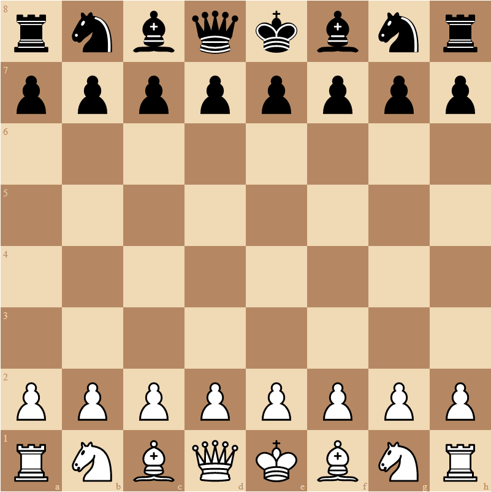

# vue-chessboard

<div align="center" markdown="1">

</div>

## What is vue-chessboard

vue-chessboard is Vue component. It provides FEN based chessboard view and functionality to your projects. This is my graduation project so there may be bug or performance issues.

## Installation

```bash
# npm
npm install @ibrahimdeniz/vue-chessboard

#yarn
yarn add @ibrahimdeniz/vue-chessboard
```

# Bare Minimum

```vue
<template>
  <chess-board @onMovePlayed="onMovePlayed" />
</template>

<script>
import { ChessBoard } from "@ibrahimdeniz/vue-chessboard";
import "@ibrahimdeniz/vue-chessboard/dist/style.css";

export default {
  name: "App",
  data() {
    return {
      chessBoardSize: 800,
    };
  },
  components: {
    ChessBoard,
  },
  methods: {
    onMovePlayed({ move, game }) {
      game.makeMove(move);
    },
  },
};
</script>
```

## Example

### Random Move Engine

```vue
<template>
  <chess-board
    :size="chessBoardSize"
    v-model:fen="fen"
    @onMovePlayed="onMovePlayed"
    @onGameOver="onGameOver"
    disableBlackMoves
  />
</template>

<script>
import { ChessBoard } from "@ibrahimdeniz/vue-chessboard";
import "@ibrahimdeniz/vue-chessboard/dist/style.css";

const ratio = 0.8;

export default {
  name: "App",
  data() {
    return {
      chessBoardSize: 800,
      fen: "",
      winner: null,
    };
  },
  components: {
    ChessBoard,
  },
  methods: {
    onMovePlayed({ move, game }) {
      game.makeMove(move);
      if (game.moves.length) game.makeMove(this.makeRandomMove(game.moves));
    },
    onGameOver({ winner }) {
      this.winner = winner;
    },
    makeRandomMove(moves) {
      const randomIndex = Math.floor(Math.random() * moves.length);
      return moves[randomIndex];
    },
  },
};
</script>
```

## Props

```js
props: {
  fen: {
    type: String,
    default: DEFAULT_FEN,
  },
  size: {
    type: Number,
    default: 800,
  },
  game: {
    type: Object,
  },
  disableWhiteMoves: {
    type: Boolean,
    default: false,
  },
  disableBlackMoves: {
    type: Boolean,
    default: false,
  },
  orientation: {
    type: String,
    default: "white",
  },
}
```

## Emits

### @onMovePlayed({ move: Move, game: ChessGame }) : Required

When any move selected, this emit executed. Move and ChessGame types are from my chess services. I will refer them coming soon.

```js
onMovePlayed({ move, game }) {
      game.makeMove(move);
},
```

### @onGameOver({ winner: "black" | "white" | "draw" , game: ChessGame }) : Optional

When game is finished, this emit executed. ChessGame type is from my chess services. I will refer it coming soon.

```js
onGameOver({ winner, game }) { }
```

## CSS

### Colors

  There are three color option for the vue-chessboard. They are `--vc-light-color`, `--vc-dark-color` and `--vc-move-color`.

  #### How to overwrite colors?

  ```vue
    <template>
    <div class="chess-board-wrapper">
      <chess-board @onMovePlayed="onMovePlayed" />
    <div>
    </template>

    <script>
    import { ChessBoard } from "@ibrahimdeniz/vue-chessboard";
    import "@ibrahimdeniz/vue-chessboard/dist/style.css";

    export default {
      name: "App",
      data() {
        return {
          chessBoardSize: 800,
        };
      },
      components: {
        ChessBoard,
      },
      methods: {
        onMovePlayed({ move, game }) {
          game.makeMove(move);
        },
      },
    };
    </script>

    <style>
      .chess-board-wrapper{
        --vc-light-color: lightgray;
        --vc-dark-color: darkgray;
        --vc-move-color: red;
      }
    </style>
  ```


## LICENSE

```
MIT License

Copyright (c) 2022 İbrahim Deniz

Permission is hereby granted, free of charge, to any person obtaining a copy
of this software and associated documentation files (the "Software"), to deal
in the Software without restriction, including without limitation the rights
to use, copy, modify, merge, publish, distribute, sublicense, and/or sell
copies of the Software, and to permit persons to whom the Software is
furnished to do so, subject to the following conditions:

The above copyright notice and this permission notice shall be included in all
copies or substantial portions of the Software.

THE SOFTWARE IS PROVIDED "AS IS", WITHOUT WARRANTY OF ANY KIND, EXPRESS OR
IMPLIED, INCLUDING BUT NOT LIMITED TO THE WARRANTIES OF MERCHANTABILITY,
FITNESS FOR A PARTICULAR PURPOSE AND NONINFRINGEMENT. IN NO EVENT SHALL THE
AUTHORS OR COPYRIGHT HOLDERS BE LIABLE FOR ANY CLAIM, DAMAGES OR OTHER
LIABILITY, WHETHER IN AN ACTION OF CONTRACT, TORT OR OTHERWISE, ARISING FROM,
OUT OF OR IN CONNECTION WITH THE SOFTWARE OR THE USE OR OTHER DEALINGS IN THE
SOFTWARE.
```
